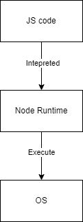

# Chapter 1: Introduction to Javascript and NodeJS
## Javascript
**Javascript (JS)** is a high-level programming language. JS initially for Front-End web development (make websites more interactive with end-users). These are some aspects of JS programming language:
- _Multi-Paradigms Programming Style_ - JS support multi-paradigms programming style. You can implement functional (most use) or object-oriented
- _Interpreted Language_ - JS is a interpreted language. That means JS need an environment to execute its code because there is no compiler for JS to convert into a specific OS environment.
- _Community_ - JS come with a large and supportive community that construct an ecosystem for JS libraries, packages and frameworks. 
## NodeJS
**NodeJS** is a platform for Javascript runtime environment (it makes JS code run). You can checkout the model below for better understanding:



1. JS code is interpreted by Node Runtime
2. Node Runtime call OS's functions based on the JS code

With NodeJS, JS now become an independent programming language that reveals all of its potentials. You can use NodeJS and Javascript to make applications (both Back-End and Front-End), libraries, frameworks, etc.
## Install NodeJS
You can follow the instructions [here](https://nodejs.org/en) to install NodeJS.

Verify that you have NodeJS installed by open your command prompt and type:
```shell
node -v
```
The result should be showing the current version of NodeJS on your computer:
```
v20.10.0
```
## Hello World!
Now it's time to write your first Javascript program!

**_Note_**: You should create a folder for later use.

Create a file called `hello.js` in your folder and write something like this:
```js
console.log("Hello World!"); console.log("Welcome to NodeJS tutorial!");
console.log("Nice to meet you!");
```
To run the program, open your `cmd` and navigate to the current folder. Then execute the following line:
```shell
node hello.js
```
In NodeJS, the JS code are interpreted each _statement_ at a time (from left to right and top to bottom). In the code above, we have 3 statements:
```js
console.log("Hello World!")
console.log("Welcome to NodeJS tutorial!")
console.log("Nice to meet you!")
```
**_Note_**: statement in JS is recognized by a new line or a semicolon ';' at the end or both.

It is a good pratice for us to not write anything anywhere in our program, so let's create a function and group our code together:
```js
function main() {
    console.log("Hello World!"); console.log("Welcome to NodeJS tutorial!");
    console.log("Nice to meet you!");
}

main();
```
Now our code is grouped in the `main()` function and from now on, we will write all our code in it.

One last thing to notice is we will use _comments_ to document our code. Comments are the developer's notes on the source code that provide insight and better understanding of what is going on in the source code or what does it do or something like that. There are 2 types of comments in Javascript: single-line and multi-lines:
```js
// This is a single-line comment
/*
    This is a multi-lines comment.
    As you can see, I can write as many lines as I want.

    It is a good pratice to regularly document your code.
*/

// This is a main() function
function main() {
    console.log("Hello World!");
    // Although JS allow that, you shouldn't write 2 statements on a single line
    console.log("Welcome to NodeJS tutorial!");
    console.log("Nice to meet you!");
}

// execute main() function here
main();
```