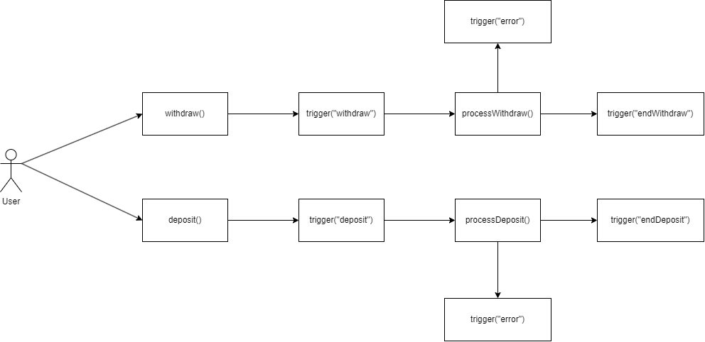

# Chapter 2: Objects and Functions
In this chapter, we will discuss about some of the powerful feature that makes JS so unique and efficient comparing to other programming language.
## Javascript Object Notation (JSON)
In JS, we can create a _dynamic_ object like this:
```js
const person = {
    firstname: "Long",
    lastname: "Le",
    age: 20
};

console.log(person.firstname);
// result: Long
```
**_Note_**: A _dynamic_ data type is a data type that is not have a clear prototype to follow (which means you can put whatever you want in it).

The JSON prepresentation of the object above is:
```json
{
    "firstname": "Long",
    "lastname": "Le",
    "age": 20
}
```
You can stringfy an object to JSON string ore parse the JSON string to object by using `JSON.stringify()` and `JSON.parse()` like this:
```js
const jsonStr = JSON.stringify(person);
console.log(jsonStr);
// result: {"firstname":"Long","lastname":"Le","age":20}

const obj = JSON.parse(jsonStr);
console.log(obj);
/*
result:
{
    firstname: "Long",
    lastname: "Le",
    age: 20
}
*/
```
The same will work on array as well:
```js
const arr = [23, { some: "data" }, ["more", "arr"]];
const jsonStr = JSON.stringify(person);
console.log(jsonStr);
// result: [23,{"some":"data" },["more","arr"]]
```
### Prototyping
Let's consider the `person` object on the example above. Let say we want to create a type for every person that come after that object and have the same properties. We can use _JSDoc_ to do that:
```js
// This object is used to make a prototype for or the person object bellow
const Person = {
    firstname: "",
    lastname: "",
    age: 0
};

// Now you can use the prototype above here
/**
 * @type {typeof Person}
 */
const p1 = {
    firstname: "Long",
    lastname: "Le",
    age: 20
};
```
This is not a good way to do prototyping but at least it works. We will discuss a more propriate way bellow.

**_Note_**: You can learn to use JSDoc [here](https://jsdoc.app/) (Good luck with that 😂😂😂).
## Function
In my opinion, function is the most powerful feature in Javascript. Here are some advance usages of function in JS:
### Function as a variable
In JS, we can declare a variable that emits the `Function` type:
```js
// Normal function declaration
function f(x) {
    return x+1;
}

// Function as a variable
const f = function(x) {
    return x+1;
}

// Arrow function
const f = (x) => {
    return x+1;
}

// Lambda expression
const f = (x) => x+1;
```
#### Problem
You are making a function to encode a string call `encodeStr()`, the process goes like this:
```
firstTransform() => secondTransform()
```
The encoding process has 2 phases. The first phase, which is `firstTransform()` is defined by the system (which you cannot know and cannot change), and the second phase is `secondTransform()` which is defined by the user that use your `encodeStr()` function. For example:
```
// This function belongs to the system therefore cannot be change
firstTransform(ABC) => CBA

// This function can be any of the below:
secondTransform(CBA) => ZYX
secondTransform(CBA) => 3.2.1
secondTransform(CBA) => how are you
```

So how do we do that?

Let's break down the problem:
1. The `encodeStr()` function will have a string parameter to receive the data from user
2. The `encodeStr()` function will call `firstTransform()` with the data that user pass into
3. After `firstTransform()` is called, it will return a string data that is required for `secondTransform()`.
4. Finally, the data returned from `secondTransform()` is returned to the user.

Therefore, our `encodeStr()` is like below:
```js
function encodeStr(data) {
    const firstPhaseData = firstTransform(data);
    return secondTransform(firstPhaseData);
}
```
But wait, where is our `secondTransform()` come from? We don't know yet because that function is user-defined. Therefore, we should allow the user of our function to pass their function to our function as a parameter:
```js
function encodeStr(data, secondTransform) {
    const firstPhaseData = firstTransform(data);
    return secondTransform(firstPhaseData);
}
```
Now, we user want to use your function, they must provide the `secondTransform()` function:
```js
/**
 * 
 * @param {string} data 
 * @param {(data: string) => string} secondTransform 
 * @returns 
 */
function encodeStr(data, secondTransform) {
    const firstPhaseData = firstTransform(data);
    return secondTransform(firstPhaseData);
}

/**
 * 
 * @param {string} data 
 * @returns {string}
 */
function myTransform(data) {
    let transformed = data;
    // you transform code

    // ------------------
    return transformed;
}

console.log(encodeStr(data, myTransform));

// Or they can write as an arrow function
console.log(encodeStr(data, (firstTransformed) => {
    // ...
    return secondTransform;
}));
```
### OOP with Function in JS
Javascript's already provided its own OOP implementation. You can read it [here](https://www.w3schools.com/js/js_object_definition.asp) and [here](https://www.w3schools.com/js/js_class_intro.asp). But I find that function and object in JS themselve are a strong mean to solve many OOP problem without the need of real OOP implementaion and keep in mind that JS is not a strong language to implement OOP. For most of the part in this section, I will demonstrate by examples.
#### Class declaration
```js
/**
 * Represent Student class
 * @param {string} firstname 
 * @param {string} lastname 
 * @param {number} age 
 */
function Student(firstname, lastname, age) {
    return {
        firstname: firstname,
        lastname: lastname,
        age: age,
        sayHi: () => {
            console.log(`Hello from ${firstname}`);
        }
    };
}

// No "new" here
const s1 = Student("Long", "Le", 20);
s1.sayHi();

// You can access s1's properties directly
s1.firstname    // Long
```
#### Encapsulation
```js
/**
 * Represent Student class
 * @param {string} firstname 
 * @param {string} lastname 
 * @param {number} age 
 */
function Student(firstname, lastname, age) {
    // We declare fields inside the function and provide getter/setter

    let _firstname = firstname;
    let _lastname = lastname;
    // const for preventing change to this field
    const _age = age;

    // private function
    const pvtFunc = () => {
        console.log("This is private");
    }

    return {
        getFirstName: () => _firstname,
        getLastName: () => _lastname,
        getAge: () => _age,
        /**
         * @param {string} firstname 
         */
        setFirstName: (firstname) => {
            _firstname = firstname
        },
        /**
         * @param {string} lastname 
         */
        setLastName: (lastname) => {
            _lastname = lastname;
        },
        // public function
        pubFunc: () => {
            // call private func
            pvtFunc();
            console.log("Hello from public function");
        }
    };
}

// Now user won't have direct access to student's properies
const s1 = Student("Long", "Le", 20);
s1.pubFunc();
```
#### Inheritance
Example 1:
```js
/**
 * @param {string} abcId
 * @param {Parameters<Student>} args 
 */
function AbcStudent(abcId, ...args) {
    const _abcId = abcId;
    // Imagine that this is super() call
    const _super = Student(...args);

    return {
        // spread all student's public properties and methods
        ..._super,
        getAbcId: () => abcId,
        // override existed method:
        pubFunc: () => {
            // equal to super.pubFunc()
            _super.pubFunc();
            console.log("Call from child!");
        }
    }
}

const abcS = AbcStudent("abc", "Long", "Le", 23);
abcS.pubFunc();
```
Example 2:
```js
/**
 * @param {ReturnType<Student>} s1 
 * @param {ReturnType<Student>} s2 
 */
function compareStudentAge(s1, s2) {
    return s1.getAge() - s2.getAge();
}

const long1 = Student("Long", "Le", 20);
const long2 = AbcStudent("code", "Long", "Phan", 21);

console.log(compareStudentAge(long1, long2));
```
And that's it for OOP with JS, we don't have polymorphism and abstraction since JS don't provide us any mean to do that.

### Enhance control over variables and functions
With the power of function in JS, we can create a wrapper to wrap any variable and function that we need to control it via event-based pattern.
#### Problem
We have a variable called `accountBalance` that need to have a strict control over it. The control flows are defined in the diagram below:



With that flow, we will have a strict control over the `accountBalance`. You can checkout my code at `accountBalance.js` file.

You can also wrap a function and manipulate it:
```js
function FuncWrapper(func) {
    const _func = func;

    return {
        call: (...args) => {
            console.log(`${func.name} is called with data:`);
            console.log(args);
            const funcData = _func(...args);
            console.log("Modifying the return data...");
            const returnData = funcData+1;
            return returnData;
        }
    };
}

/**
 * 
 * @param {number} a 
 * @param {number} b 
 * @returns {number}
 */
function sum(a, b) {
    return a+b;
}

function main() {
    const wrappedFunc = FuncWrapper(sum);
    // 1 + 1 = 3
    console.log(wrappedFunc.call(1, 1));
}

main();
```
## Summary
In conclusion, Javascript Objects and Functions are powerful tools for you to exploit many things that other programming language cannot or maybe hard to do. Let your imagination runs wild and JS will do the rest for you. 😉