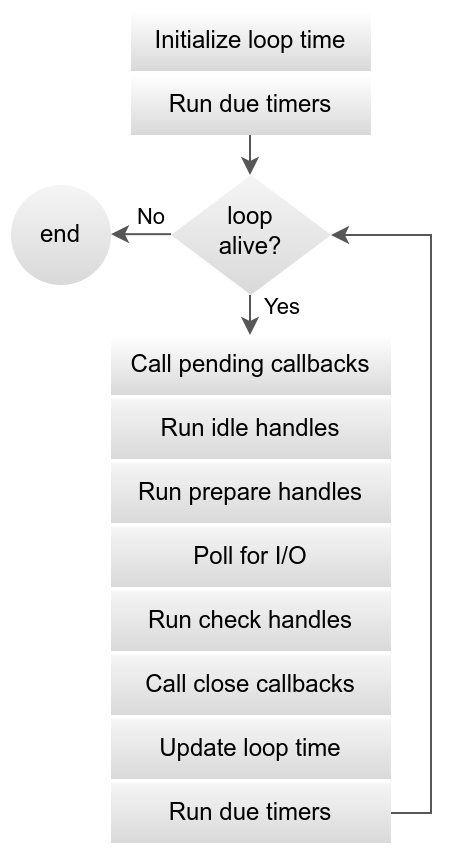

# Chapter 3: Asynchronous Programming with NodeJS
Though NodeJS is **single-threaded**, it is built for not blocking the main thread. There are many reasons to not block the main thread, for example, your program need to serve the end-user by waiting for their actions and response to those while there are still background tasks. 
```js
while (true) {
    const action = waitForUserAction();
    switch (action) {
        // response for action
        ...
    }

    // Not logical because this needs to be execute at the same time
    otherBackgroundTasks();
}
```
Other programming languages handle asynchronous works by creating new threads. Though NodeJS still provides you the way to create new threads, you are not recommended to do that because NodeJS already solved that problem for you by using the [I/O (or event) loop](https://docs.libuv.org/en/v1.x/design.html).



The methodology is NodeJS will have a place to store and check the status of the tasks that need to execute asynchronously. You can checkout the official document for the full explaination.
## NodeJS Timers
One of the first solution that you can come up with is the Node JS Timers. All of the timer functions will make a schedule for your code, which make your code run "later". 
### `setTimeout()`
`setTimeout()` function schedule your code to be execute after some delay time (ms). For example:
```js
setTimeout(() => {
    console.log("This function will be delay by 3 seconds.");
}, 3000);
setTimeout(() => {
    console.log("This function has no delay.");
});
console.log("This line has no delay but it's blocking the main thread.");
```
### `setInterval()`
When you have a set of code that need to be execute every some delay time (ms), you can use `setInterval()`:
```js
setInterval(() => {
    console.log("This function will be execute every 3 seconds.");
}, 3000);
```
### Clearing schedules
Both `setTimeout()` and `setInterval()` return the schedule IDs that are needed to call `clearTimeout()` or `clearInterval()`.
```js
const id = setTimeout(() => {
    console.log("This function will never be execute.");
}, 3000);

setImmediate(() => {
    clearTimeout(id);
    // Work the same for setInterval()
});
```
So now we can re-define the first example flow into some thing like this:
```js
const mainInterval = setInterval(() => {
    const action = waitForUserAction();
    switch (action) {
        // response for action
        ...
        case "quit": {
            clearInterval(mainInterval);
            clearInterval(tasksInterval);
            break;
        }
    }
});

const tasksInterval = setInterval(() => {
    otherBackgroundTasks();
}, tasksTime);
```
## Event-based Asynchronous Pattern (EAP)
We are already discuss this topic in [Chapter 2](./chap2.md), but now I want us to dive deeper in this to see what it really is and how to apply it.

In many real-life situations, we cannot explain things (or maybe it is not optimized to do things) by a sequential set of logics. The example above it one of those. 


Below is one example to write your own EAP implementation with NodeJS:
```js
function EapProgram(func) {
    const _func = func;
    let _intervalID = undefined;
    const _schedules = [];
    const _schedulesIDs = [];
    const _handlerMap = {};

    const manager = {
        emit: (eventName, ...args) => {
            if (_handlerMap[eventName]) {
                _handlerMap[eventName](...args);
            }
        },
        end: () => {
            if (_intervalID) {
                clearInterval(_intervalID);
            }
            if (_schedulesIDs) {
                for (const id of _schedulesIDs) {
                    clearInterval(id);
                }
            }
        }
    }

    return {
        listen: () => {
            if (_schedules) {
                for (const schedule of _schedules) {
                    _schedulesIDs.push(setInterval(schedule.task, schedule.time));
                }
            }
            _intervalID = setInterval(() => _func(manager));
        },
        on: (eventName, handler) => {
            _handlerMap[eventName] = handler;
        },
        schedule: (task, time) => {
            _schedules.push({ task, time });
        }
    };
}

const program = EapProgram((manager) => {
    console.log("Hello");
    manager.emit("action");
    manager.end();
});

program.on("action", () => {
    console.log("There is an action.");
});

program.schedule(() => {
    console.log("Bg Task");
});

program.listen();
```
Using EAP helps us manage our code more efficiently since it follow a well-defined pattern.
## Make your code ... synchronous again?
Sometimes, we want to revert back to synchronous programming or simply you need to convert an asynchronous function to fit the synchronous context of your program.
### `Promise`
NodeJS provide you 2 types of asynchronous - EAP-based and Promise-based, we haven't discussed about `Promise` yet. Promise is usually used when you want to easily convert from async to sync since Promise actually can make the program blocked.
```js
const f = () => new Promise((resolve, reject) => {
    // Your program is blocked until resolve() or reject() is called. 
});

f()
    .then((data) => {
        // handle resolved data
    })
    .catch(err => {
        // handle when error
    });
``` 
> [!IMPORTANT]
> * Call `resolve(data)` when the promise is successfully fullfilled.
> * Call `reject(err)` when the promise is fullfilled with error.

With that mechanism, we can transform the EAP into synchronous:
```js
const f = () => new Promise((resolve, reject) => {
    // Program is blocked until "action" is emit by the wrapper
    wrapper.on("action", (data) => resolve(data));
});

f();
```
### `async...await`
One final feature that NodeJS offers you is `async` and `await`. `async` is the faster way to create `Promise`:
```js
const f = async () => {
    // reject by throw
    // resolve by return
    return data;
}

f()
    .then((data) => {
        // handle resolved data
    })
    .catch(err => {
        // handle when error
    });
```
The game-changer here is `await`. As you may notice, `Promise` don't turn your code into synchronous, actually it makes your code run asynchronously, which is not what we want. `await` is created to, as you might guess, wait for the `Promise` until it is fullfilled, thus it really block our program, prevent the program to do anything until a `Promise` is fullfiled.
```js
const f = async () => {
    return data;
}

async function main() {
    // Note that you can only await Promise (async function)
    const data = await f();
    console.log(data);
}

main();
```
> [!IMPORTANT]
> `await` can be only used in `async` function, so when use want to use `await`, place `async` before your function. It is a good practice to have your `main()` function `async` because it will allow you to flexible switch from asynchronous and synchronous programming.
## Conclusion
I'm lazy. Read these:
* [NodeJS - Asynchronous flow control](https://nodejs.org/en/learn/asynchronous-work/asynchronous-flow-control)
* [Libuv - Design overview](https://docs.libuv.org/en/v1.x/design.html)
* [Node JS Architecture - Single Threaded Event Loop](https://www.digitalocean.com/community/tutorials/node-js-architecture-single-threaded-event-loop)